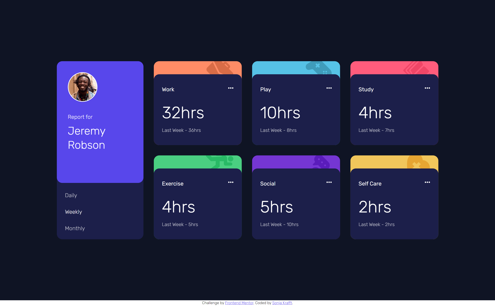
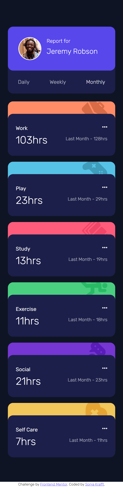

# Frontend Mentor - Time tracking dashboard solution

This is a solution to the [Time tracking dashboard challenge on Frontend Mentor](https://www.frontendmentor.io/challenges/time-tracking-dashboard-UIQ7167Jw). Frontend Mentor challenges help you improve your coding skills by building realistic projects. 

## Table of contents

- [Overview](#overview)
  - [The challenge](#the-challenge)
  - [Screenshot](#screenshot)
- [My process](#my-process)
  - [Built with](#built-with)
  - [What I learned](#what-i-learned)
  - [Useful resources](#useful-resources)
- [Author](#author)

## Overview

### The challenge

Users should be able to:

- View the optimal layout for the site depending on their device's screen size
- See hover states for all interactive elements on the page
- Switch between viewing Daily, Weekly, and Monthly stats

### Screenshot




## My process

### Built with

- HTML, SCSS, JS
- Mobile-first workflow
- Webstorm with Simple Hot Reload Server (install: `npm install -g simple-hot-reload-server`, start: `hrs`) and File Watcher with SCSS for building CSS

### What I learned

Use this section to recap over some of your major learnings while working through this project. Writing these out and providing code samples of areas you want to highlight is a great way to reinforce your own knowledge.

To see how you can add code snippets, see below:

- Import JSON
```js
import data from '../../data.json' with { type: 'json' };
```
- Append HTML Elements
```js 
  card.innerHTML = `
  <div>...</div>`;

  dashboard.appendChild(card);
```
- Meatballs Menu: see `_meatballs.scss`

### Useful resources

- [How to use promises](https://developer.mozilla.org/en-US/docs/Learn/JavaScript/Asynchronous/Promises)
- [JavaScript modules](https://developer.mozilla.org/en-US/docs/Web/JavaScript/Guide/Modules)
- [Working with JSON](https://developer.mozilla.org/en-US/docs/Learn/JavaScript/Objects/JSON)
- [How To Use the filter() Array Method in JavaScript](https://www.digitalocean.com/community/tutorials/js-filter-array-method)
- [Using data attributes](https://developer.mozilla.org/en-US/docs/Learn/HTML/Howto/Use_data_attributes)
- [Manipulating documents](https://developer.mozilla.org/en-US/docs/Learn/JavaScript/Client-side_web_APIs/Manipulating_documents)

## Author

- Github - [Sonja Krafft](https://www.github.com/sonmikrafft)
- Frontend Mentor - [@sonmikrafft](https://www.frontendmentor.io/profile/sonmikrafft)